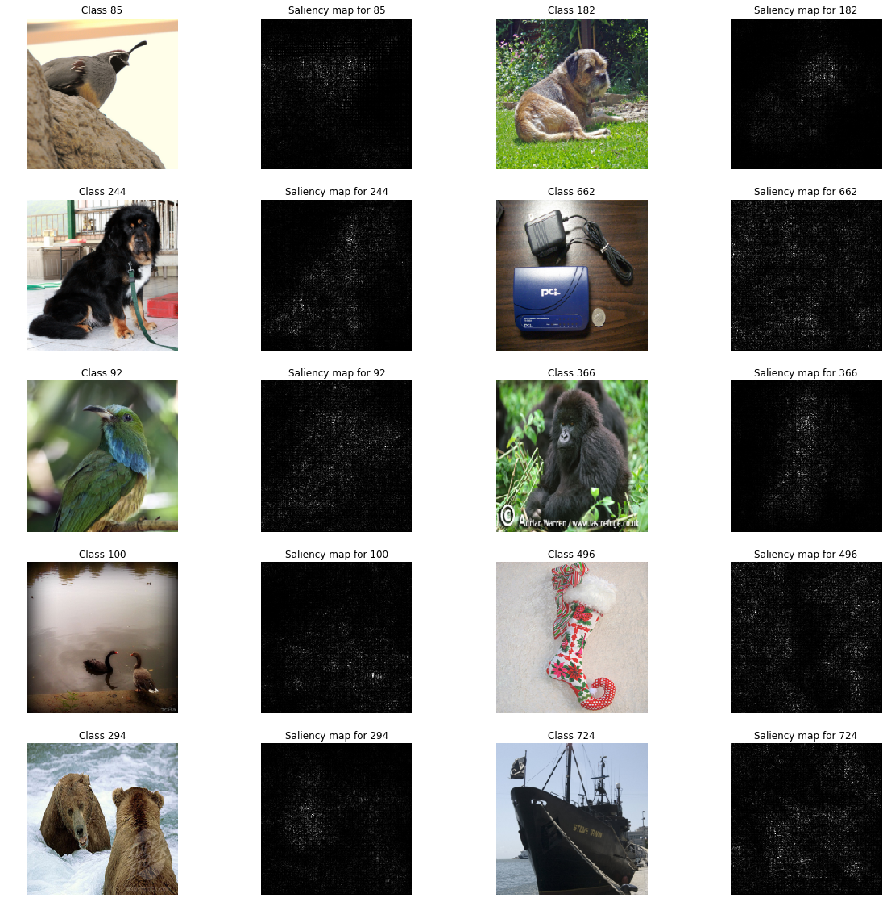
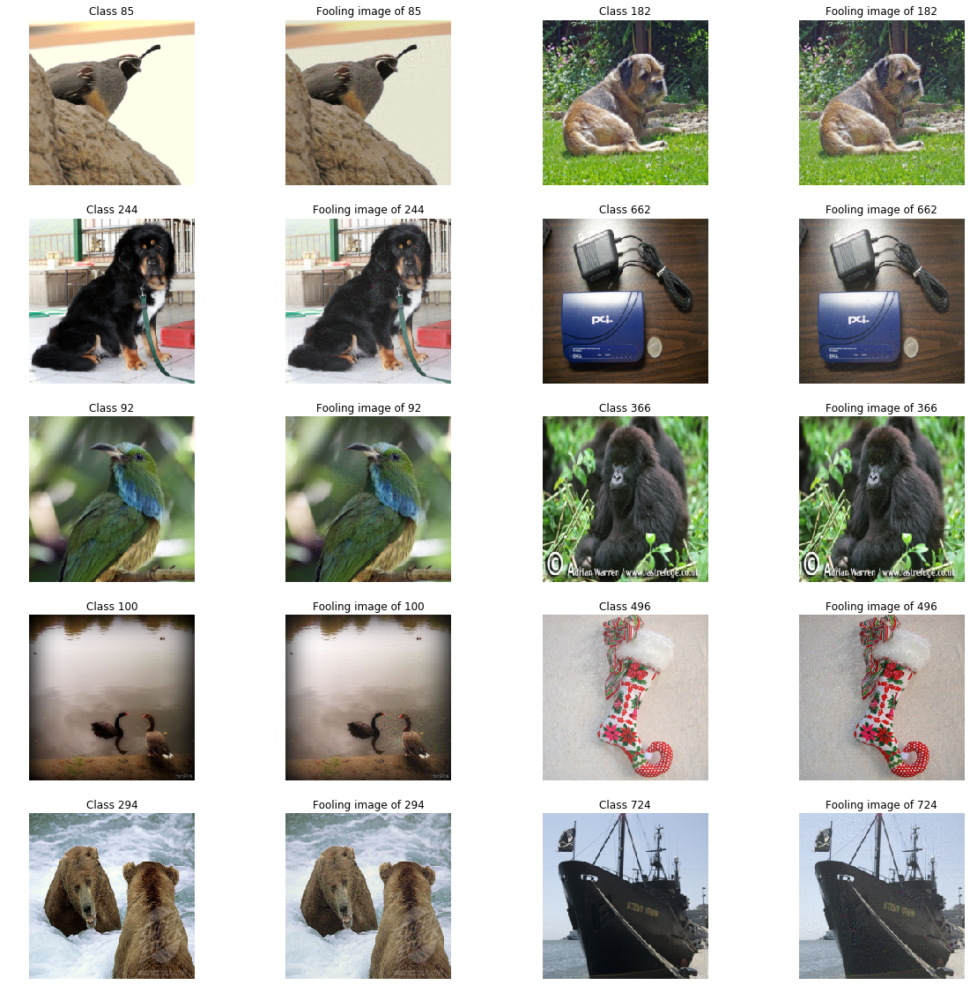
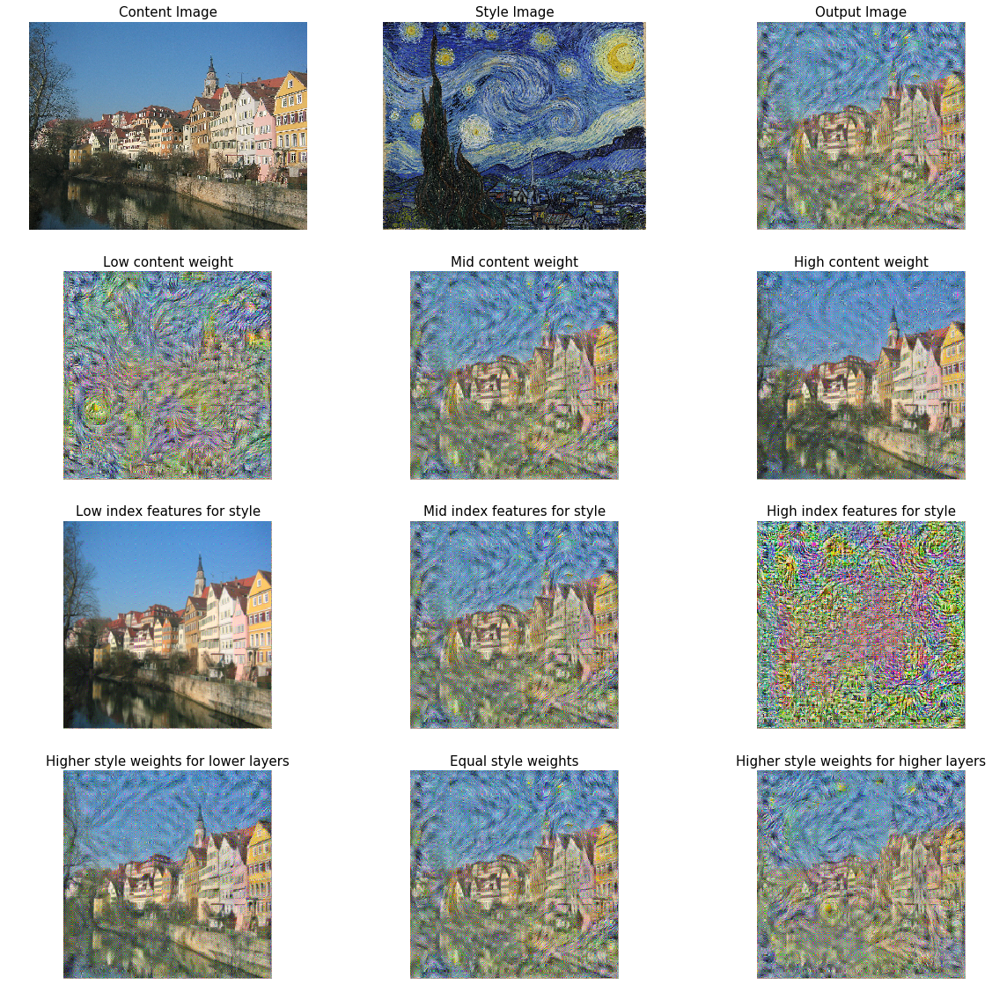

# Deep Learning and Image Processing
This repository looks the the use of image gradients along with various deep learning methods to implement the following three ideas:
1. **Saliency Maps**: [Saliency maps](https://en.wikipedia.org/wiki/Saliency_map) allow us to understand which parts of an image were focused on by the nerual network to achieve its results. The code implements the algorithm presented by [K. Simoyan et al.](https://arxiv.org/abs/1312.6034)
2. **Fooling Images**: Fooling images are images altered by minute amounts of noise (imperceptible to the human eye) to fool the neural network to predict it wrongly. This can be used by an adversarial to get unwanted results from a neural network. THe code implemented here is from the paper by [C. Szegedy et al.](https://arxiv.org/abs/1312.6199)
3. **Style Transfer**: [Neural Style Transfer](https://en.wikipedia.org/wiki/Neural_Style_Transfer) involves using a neural network to transfer the style of one image into another, while preserving the content of the second. This code implements the algorithm by [L.A. Gatys et al.](https://www.cv-foundation.org/openaccess/content_cvpr_2016/html/Gatys_Image_Style_Transfer_CVPR_2016_paper.html)

## Running the code
The Jupyter notebook requires the `pytorch` package.

## Some Results

#### 1. Saliency Maps

#### 2. Fooling Images
In the examples below, each fooling image, when fed to the neural net predicts a class 8 classes below the correct ID.

#### 3. Style Transfer
